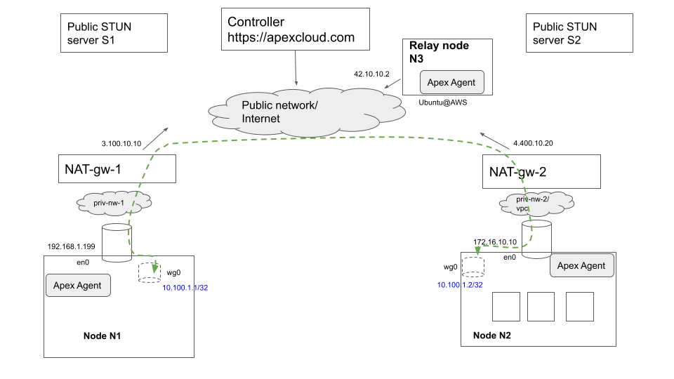

# High Level Solution Architecture

The following figure illustrates briefly how the overall solution works. .

The figure illustrates two edge nodes N1 and N2 that are each running in their own respective 
private networks in which private IP addressesing is used (based on RC 1918 for instance), and hence these nodes/ devices are not directly addressable from outside their own private networks.  Access to the public internet is via NAT gateways in each private network that perform SNAT (Source Network Address Translation), translating the private source IP address and source TCP and UDP ports of packets originated by devices inside the private network when sending traffic to external destinations on the public network or Internet. In the example shown, NAT-gw-1 performs SNAT and swaps in its public facing IP address (3.100.10.10) and an available TCP/ UDP port on this IP address for traffic originated within the private network and destined for the public Internet.

A brief summary of Apex operation in this environment is as follows. Nodes N1 and N2 are running the Apex agent and register themselves with the Apex controller SaaS running at public Internet endpoint https://apexcloud.com. In this particular scenario, there is also a relay node (interchangeably also referred to as a "hub router" in the Apex documentation), which is any Linux Virtual machine running in the same Apex Zone as nodes N1 and N2 and directly reachable on the public internet.

The agents determine their own respective public IP address and port via one of two techniques. (1) They initiate a query using the STUN protocol (Session Traversal Utilities for NAT) towards 1 or more well known public STUN servers run by providers such as Google. These servers provide a free service 
that returns a STUN response containing in its inband payload, the SNAT'ed public IP and source port information it sees for the STUN request, thereby enabling the Apex agents in this case to determine their own public (IP address, port). (2)  They can connect to the Apex controller SaaS which in turn can reflect their public (IP address, port) seen by the controller and the relay node to all Apex nodes in the zone, thereby enabling every node to determine the public reachability information of every other node within the Apex zone (subject to any additional administered policies that may filter distribution of reachability information within a zone).  The apex agents can then attempt to initiate Wireguard  tunnel sessions with each other's public IP information. In most common cases, this attempt shoudl succeed since the NAT gateways at each location have already opened up these public facing ports for the outbound connections initiated previously by the Apex agents when connecting to the Apex controller and relay nodes. In the case where the NAT gateways execute a stricter form of Source NATting known as Symmetric NAT, it may not be possible for apex nodes to initiate wireguard tunnels directly with each other, in which case they have logic to revert to sending traffic to the relay node and having it perform an IP routing operation towards the target Apex node. As far as end user application traffic on each node is concerned, it is routed to use the Wireguard virtual interface and get encrypted and tunneled towards the desired destination wireguard interface IP by the wireguard interface driver logic. 

This was a brief summary of the overall architecture and operation of the Apex solution. There are additional details related to how end devices register with the the controller and secure cryptographic identification of end points using X.509 certificates whicih are not covered here for the sake of brevity. Also note that at the time of writing, the Apex architecture is still evolvign and some concepts described here may change eventually. For instance in the current desig, the use of the relay node is optional within an Apex zone and STUN servers are queried to determine public IP mapping information. A future version of this design may be altered to mandate the use of the relay nodes and also use these for public IP information discovery without depending on public STUN servers. The purpose of this summary is to illustrate the core concepts while recognizing that some of the details may change as the architecture evolves.  

